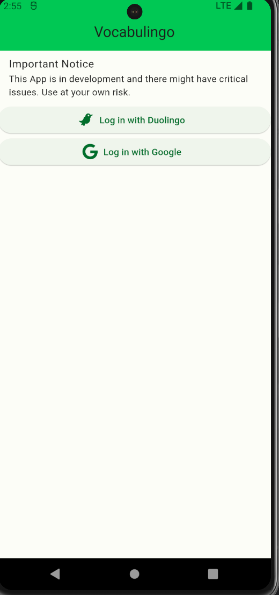
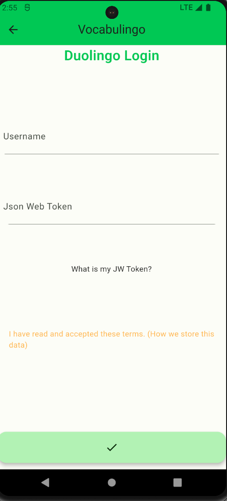
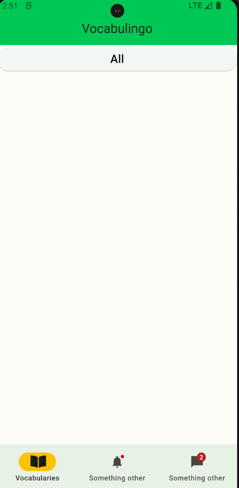

# vocabulingo

Vocabulingo is an Vocabulary learn APP connected to your Duolingo account.

## Basic Principals

Learn A Language in duolingo and study vocabularies in vocabulingo with the use of index cards

